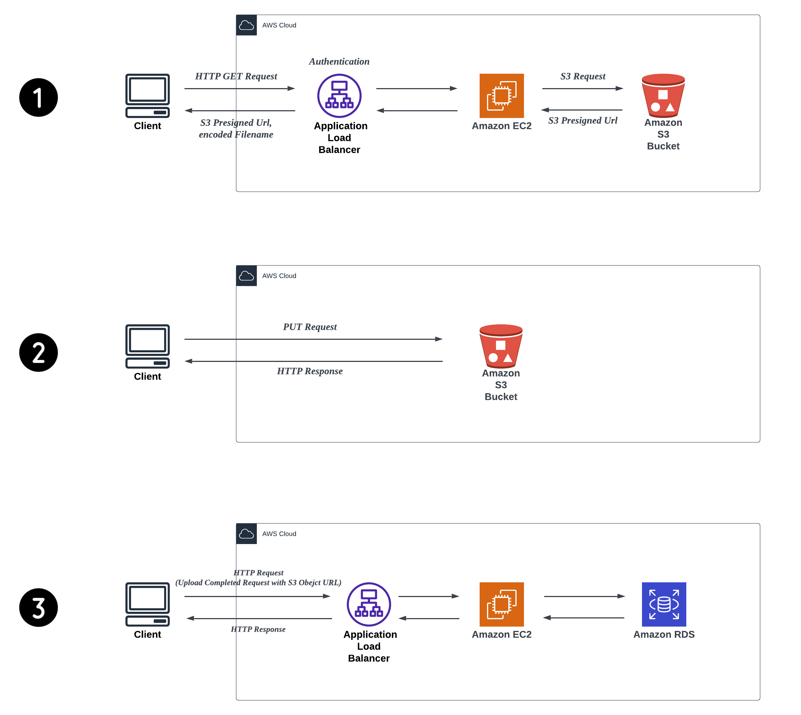

<div align="center">

# Synnote Backend API Server

</div>

## 목차

- 프로젝트 개요
  - 프로젝트 소개
  - 시스템 구성도
  - 개발 환경
- 구성
  - AWS 아키텍쳐
  - 데이터베이스 ERD 및 RDB 구조
  - Flyway 적용
  - AWS S3 Presigned URL 기반 녹음본 파일 업로드
  - REST API Custom Response Body
- 트러블 슈팅
  - AWS ALB(Ingress) + AWS Cognito 인증 환경에서의 CORS 문제
- 리팩토링
  - Entity 클래스 설계 직접 참조 → 간접 참조 리팩토링

## 프로젝트 개요

### 프로젝트 소개
다중 음성 분석을 활용한 Live 문서 기록 및 분석 어시스턴트 서비스

멀티 모달 기반의 Live 음성 기록 정리 어시스턴트로, 강의나 회의 같은 곳에서 다중 음성 분석 기술을 활용해 기록하고 시각화 함으로써 효율적으로 사용자들의 기록물을 동기화하는 협업 플랫폼 서비스이다.

### 시스템 구성도


### 개발환경
`Java`, `Spring Boot`, `JPA`, `Mysql`, `AWS`, `K8S`, `Docker`, `Terraform`

## 구성

### AWS 아키텍처
[AWS 아키텍처.v1 to v4 발전 History 문서](https://periodic-case-901.notion.site/AWS-Architecture-b56d623fb3b64cd998b761b8bc42c78a)


### 데이터베이스 ERD 및 RDB 구조
[데이터베이스.v1 to v4 발전 History 문서](https://periodic-case-901.notion.site/Database-ERD-RDB-5f09baedde4f46608c1ba51255328e0d?pvs=4)


### Flyway 적용
[Flyway 적용기](https://periodic-case-901.notion.site/Flyway-798cf8e4125c4f599f098b41dcca6161?pvs=4)

### AWS S3 Presigned URL 기반 녹음본 파일 업로드
[AWS S3 Presigned URL 기반 녹음본 파일 업로드](https://periodic-case-901.notion.site/AWS-S3-Presigned-URL-8b988752eca2403e8bd096b3c0b82611?pvs=4)



### REST API Custom Response Body
[REST API Custom Response Body](https://periodic-case-901.notion.site/REST-API-Custom-Response-Body-ac701a8ff0434446bfbcce53c720aeb6?pvs=4)

```
{
	"resultCode": 0,
	"message": "OK",
	"data": {
    
	}
}

- resultCode: 처리 결과 상태 코드
- message: 개발자가 위키를 보지 않아도 알 수 있는 메세지 값, 개발자를 위한 메세지
- data: API가 전달해야하는 리소스 내용 혹은 처리 결과 값
```

## 트러블 슈팅

### AWS ALB(Ingress) + AWS Cognito 인증 환경에서의 CORS 문제
[정리 내용](https://periodic-case-901.notion.site/AWS-ALB-Ingress-AWS-Cognito-CORS-7e7f6e7e45d94242a7a4eeff251a74af?pvs=4)

## 리팩토링

### Entity 클래스 설계 직접 참조 → 간접 참조 리팩토링
[정리 내용](https://periodic-case-901.notion.site/Entity-0c886ab7bbf6457d9a0d4b1832e2d5cb?pvs=4)